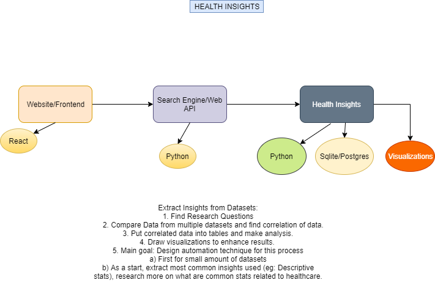

[](./LICENSE)


# social-insights
Social insights is an open source big data project that generates insights about various interesting topics happening every day. Currently, we are focusing on political sentiment analysis due to the upcoming elections in the United States. Data sources include the Twitter API. There is a search engine built to query the insights.

## Getting Started

The project is broken down into 3 parts: 
* dataproc: All the analytics, database work, and ML. 
* search-engine: The API work and the querying/search engine system
* web: the web server to render visualization and integrate dataproc and search-engine components

<!--  -->

### Prerequisites

To run and setup the project you need python, node.js and NPM installed for the visualizations, which can be found [here](https://nodejs.org/en/). For the data processing you need python which can found [here](https://www.python.org/downloads/release/python-374/).

### Installing

To get started on backend:
```
git clone https://github.com/dsc-umass/social-insights.git

cd backend

pip3 install pipenv

pipenv shell

pipenv install
```

To get started on website:
```
git clone https://github.com/dsc-umass/social-insights.git

cd web

yarn install
```
<!-- 
## Deployment

To get started on visualizations:
```
cd dataproc/

sudo pm2 start api.py --name social-insights --interpreter=python3 -->

## Built With

* [Twitter API](https://developer.twitter.com/) - Sentiment Analysis and Data Analytics
* [Flask](http://flask.palletsprojects.com/en/1.1.x/) - API Framework
* [PM2](https://pm2.keymetrics.io/) - Production Server and Load Balancing
* [React](https://reactjs.org/) - Frontend framework for the website
* [NLTK](https://www.nltk.org/) - For the search engine

